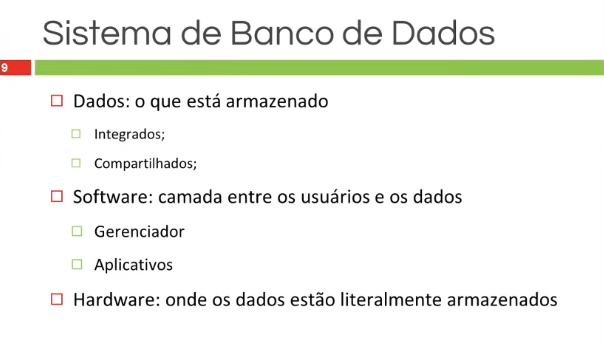
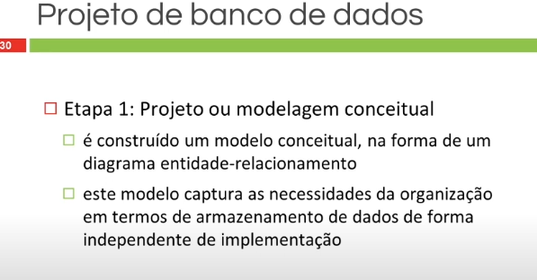

# 02/01/25 - CURSO DBA IFRS - DAY 1

## 1 Banco de Dados: conceitos

## 1.1 Fundamentos de BD

## 1.2 Fundamentos de BD

## 1.3 Fundamentos de BD

## 1.4 Sistemas Geradores de Banco de Dados

## 1.5 Projeto de Banco de Dados: etapas

## 1.6 Teste seus conhecimentos

